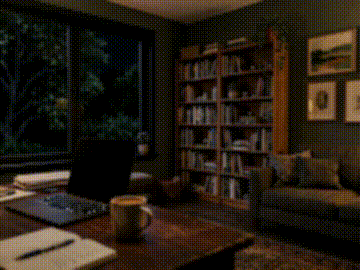
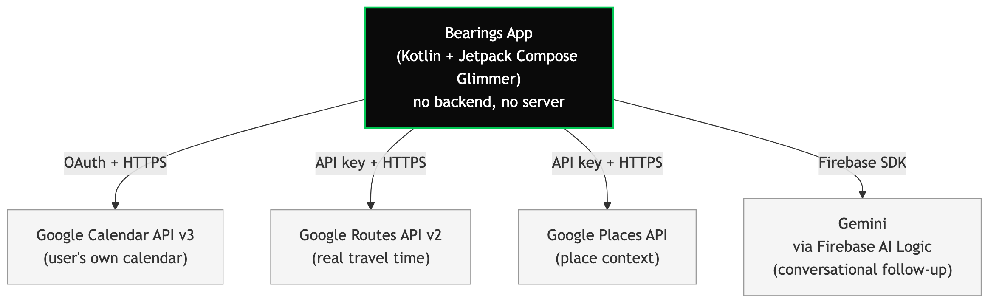

# Bearings — Android XR Concept Prototype

An ambient navigation companion for Android XR display glasses, built for the moment of
arriving somewhere unfamiliar. This repo is the concept prototype: a five-card glanceable
stack running natively on the projected AI Glasses display, built with Kotlin, Jetpack
Compose, and Jetpack Compose Glimmer.

Full product pitch and technical decision record: see [`docs/TECHNICAL-DECISIONS.md`](docs/TECHNICAL-DECISIONS.md).

## Demo



Full-quality video with audio: [`docs/assets/Bearings_Demo.mp4`](docs/assets/Bearings_Demo.mp4)

## Architecture



## What it does

Five cards, shown one at a time, navigated by tap or swipe:

1. **Leaving soon** — a departure nudge computed from a calendar event and travel time.
2. **Getting there** — calm, textual transit cues.
3. **Around you** — place context (hours, distance).
4. **Sign ahead** — the meaning of a sign in a language you don't read.
5. **Ask Bearings** — a hands-free voice question, answered via Gemini.

All content is mock data for this prototype scope. Real Calendar/Routes integration is
scaffolded under `app/src/main/kotlin/com/bearings/data/stretch/` behind the same
repository interfaces the real implementations will use.

## Running it

Requires **Android Studio Canary** (the Jetpack XR SDK tooling isn't in the stable
channel yet) with a **Display Glasses** AVD and a phone AVD to host it, paired via the
Glasses Pairing Assistant. See `docs/TECHNICAL-DECISIONS.md` for the exact setup and the
launch gotcha (Android Studio's Run button targets the phone display by default, which the
system rejects for this glasses-only activity — launch via adb targeting the detected
`ProjectionDisplayRestricted` display id instead).

```bash
./gradlew assembleDebug
adb -s <phone-emulator> install -r app/build/outputs/apk/debug/app-debug.apk
adb -s <phone-emulator> shell dumpsys display | grep ProjectionDisplayRestricted   # find the display id
adb -s <phone-emulator> shell am start -n com.bearings/.GlassesActivity --display <id>
```

## Project structure

```
app/src/main/kotlin/com/bearings/
├── GlassesActivity.kt              # XR entry point — routes to the projected display
├── data/
│   ├── CardModel.kt
│   ├── CardRepository.kt / MockCardRepository.kt
│   └── stretch/                    # Real Calendar/Routes integration (not yet wired)
└── ui/cards/
    ├── CardComposable.kt           # Native Glimmer Card/Text/Icon
    └── CardStackComposable.kt      # Single-card-at-a-time navigation
```

## Status

Must-have prototype scope is complete: builds clean, runs natively on the projected AI
Glasses display, all 5 cards navigate, and a demo recording has been captured. See
`docs/TECHNICAL-DECISIONS.md` for the full technical decision record, including what
changed from the original plan and why.

## Who's building it

Israel Pasaca — a software engineer with 5+ years across full-stack and mobile
development. By day, Lead Software Engineer at Thoughtworks, working on production
mobile platforms at scale.

## IP

Independent side project. Full ownership rests with the developer — not affiliated with
any employer or client.
